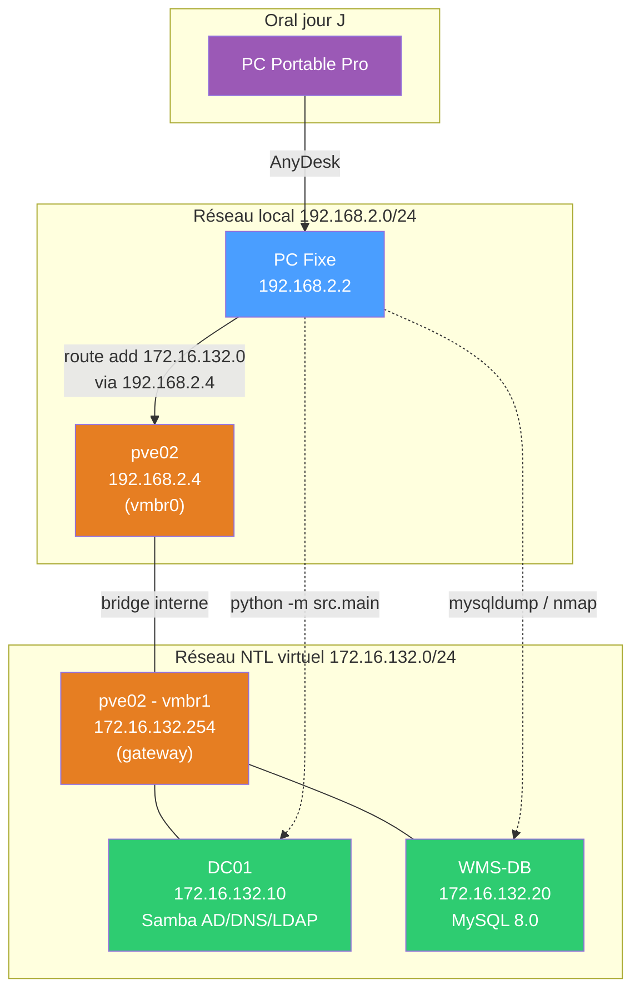

# Démo NTL-SysToolbox — Homelab (pve02)

Guide pour lancer la toolbox sur le lab homelab en fallback de l'école.

## Pré-requis

- PC fixe connecté au réseau local (192.168.2.0/24)
- pve02 allumé (les VMs démarrent automatiquement avec)
- Route Windows active : `route add 172.16.132.0 mask 255.255.255.0 192.168.2.4 if 15 -p`
- MySQL client installé (`winget install Oracle.MySQL`)
- nmap installé
- PATH inclut : `C:\Program Files\MySQL\MySQL Server 8.4\bin`

## Lab : 2 VMs sur pve02

| VM | VMID | IP | Services | Credentials |
|----|------|----|----------|-------------|
| DC01 | 110 | 172.16.132.10 | Samba AD DC (ntl.local), DNS, LDAP, Kerberos | Administrator / **** |
| WMS-DB | 120 | 172.16.132.20 | MySQL 8.0 (base `wms`), SSH | sysadmin / **** |

AD users : `wms-service`, `admin-ntl`, `j.dupont`, `m.martin`
MySQL : 8 shipments, 6 inventory

## Avant la démo

```bash
# Vérifier que tout est up
bash start-demo.sh
```

Tous les checks doivent être `[OK]`. Si un check échoue :
- VMs éteintes → Proxmox Web UI `https://192.168.2.4:8006` > démarrer VM 110 + 120
- Route perdue → relancer `route add 172.16.132.0 mask 255.255.255.0 192.168.2.4 if 15` en admin
- Snapshot clean → Proxmox > VM > Snapshots > `clean-state` > Rollback

## Lancer la toolbox

```bash
cd C:\Users\Dharma\Documents\Pro\Ecole\Rendu\MSPR\MSPR2
python -m src.main
```

## Scénario de démo (5 min)

### 1. Diagnostic — Vérifier AD/DNS (Choix 1 > 1)

```
Menu principal > 1 (Diagnostic) > 1 (Vérifier AD/DNS)
IP du DC : [Entrée pour défaut = 172.16.132.10]
```

**Ce que ça fait :** Résout `ntl.local` via le DNS du DC, scanne les ports AD (53, 88, 389, 445, 3268), teste le bind LDAP.
**Résultat attendu :** WARNING (DNS OK, Ports OK, LDAP OK, WinRM non configuré = normal).

### 2. Diagnostic — Vérifier MySQL (Choix 1 > 2)

```
Menu principal > 1 (Diagnostic) > 2 (Vérifier MySQL)
IP du serveur : [Entrée pour défaut = 172.16.132.20]
```

**Ce que ça fait :** Connexion TCP sur le port 3306, récupère la version MySQL via le banner.
**Résultat attendu :** OK — MySQL 8.0.45 détecté.

### 3. Diagnostic — Services Linux (Choix 1 > 3)

```
Menu principal > 1 (Diagnostic) > 3 (Vérifier services Linux)
IP du serveur : 172.16.132.10
```

**Ce que ça fait :** Scanne les ports configurés (22, 53, 88, 389, 3306) et identifie les services ouverts.
**Résultat attendu :** OK — 4 services (SSH, DNS, Kerberos, LDAP) sur DC01.

### 4. Backup — Dump SQL (Choix 2 > 1)

```
Menu principal > 2 (Backup) > 1 (Backup base de données)
Base à sauvegarder : [Entrée pour défaut = wms]
```

**Ce que ça fait :** Exécute `mysqldump` sur la base `wms` de WMS-DB (172.16.132.20), sauvegarde le .sql dans `output/backups/`.
**Résultat attendu :** OK — fichier `wms_YYYYMMDD_HHMMSS.sql` créé (~4 KB).

### 5. Audit — Scanner réseau (Choix 3 > 1)

```
Menu principal > 3 (Audit) > 1 (Scanner le réseau)
Plage réseau : [Entrée pour défaut = 172.16.132.0/24]
```

**Ce que ça fait :** Lance un scan nmap sur le subnet, détecte les hosts up et leurs ports ouverts.
**Résultat attendu :** OK — 2 hosts trouvés (DC01 + WMS-DB) avec leurs services.

### 6. Quitter (Choix 0)

## Dépannage rapide

| Problème | Solution |
|----------|----------|
| `ping 172.16.132.10` timeout | Vérifier route : `route print \| findstr 172.16.132` |
| VM éteinte | SSH pve02 : `qm start 110` / `qm start 120` |
| MySQL refuse connexion | SSH WMS-DB : `sudo systemctl restart mysql` |
| Samba plante | SSH DC01 : `sudo systemctl restart samba-ad-dc` |
| Tout cassé | Rollback snapshot : `qm rollback 110 clean-state && qm rollback 120 clean-state && qm start 110 && qm start 120` |

## Architecture


